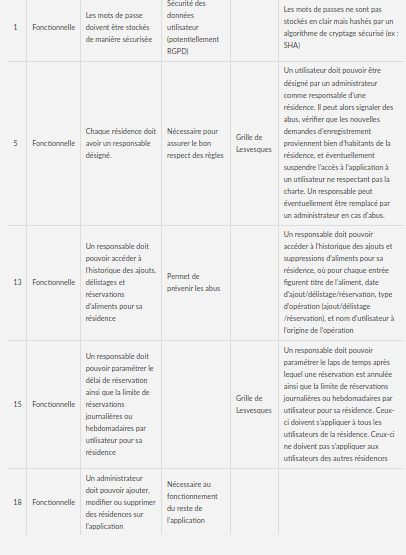

# I	Fondements du projet
## 1. But du projet
### a. Problème de l’utilisateur ou contexte du projet 
Il arrive que les étudiants doivent se débarrasser de leur nourriture pour diverses raisons :
* s'ils ont acheté quelque chose qu'il n'aiment pas,
* s'ils ont cuisiné quelque chose qu'il n'aiment pas,
* s'ils rentrent chez leurs parents pendant les vacances 
etc ...

Certains essaient parfois de donner à leurs voisins mais souvent le passage à la poubelle est inévitable.

### b. Objectifs du projet
Mettre en place un système de frigo participatif dans les résidences étudiantes afin d'éviter le gaspillage de nourriture.
## 2. Personnes et organismes impliqués dans les enjeux du projet 
### a. Maître d’ouvrage
Egalement désignés par le terme "administrateurs", il s'agit de l'équipe "12caracteres" à l'origine de ce cahier des charges et composée de M. Nathan FUENTES, M. Gawein LE GOFF et M. Zacharia MESBAH
### b. Acheteur
### c. Autre parties prenantes
* Gérants des résidences : accord nécessaire pour l'installation du réfrigérateur commun dans les résidences
* Annonceurs publicitaires : potentiellement impliqués dans de futures versions, afin de proposer des publicités dans le but de générer un profit à partir de l'application
## 3. Utilisateurs du produit
### a. Utilisateurs directs du produit
* Les habitants des résidences dans lesquels un frigo est installé
### b. ~~Priorité assignée aux utilisateurs~~
### c. ~~Implication nécessaire de la part des utilisateurs dans le projet~~
### d. Utilisateurs concernés par les opérations de maintenance du produit
* Certains étudiants (min. 1 par résidence) désignés comme responsables du frigo
* Service des résidences INSA (Électricité)
# II	Contraintes sur le projet 
## 4. Contraintes non négociables
### a. Contraintes sur la conception de la solution
### b. Environnement de fonctionnement du système actuel
### c. Applications « partenaires » (avec lesquelles le produit doit collaborer)
### d. « COTS » : Progiciels ou composants commerciaux
### e. Lieux de fonctionnement prévus
### f. De combien de temps les développeurs disposent-ils pour le projet ?
### g. Quel est le budget affecté au projet ?
## 5. Glossaire et conventions de dénomination
* **Résidence** : Résidence étudiante dans laquelle résident des utilisateurs
* **Utilistateur** : Egalement appelé "étudiant". Toute personne utilisant l'application
* **Utilisateur enregistré** : Utilisateur ayant sélectionné une résidence.
* **Utilisateur confirmé** : Egalement appelé "adhérent". Utilisateur enregistré dans une résidence ayant été vérifié par le responsable de cette dernière comme étant réellement habitant de cette résidence, et ayant accepté la charte de cette dernièré.
* **Responsable** : Utilisateur ayant été désigné par les administrateurs de l'application pour assurer le respect de la charte et des règles de bonne conduite chez les utilisateurs de la résidence dont il est responsable
* **Administrateurs** : Maîtrise d'ouvrage
* **Aliment** : Aussi appelé "reste". Toute denrée alimentaire (plat cuisiné, ingrédient, etc...) listée sur l'application.
* **Charte** : Ensemble de règles à respecter par les utilisateurs. Elle est constituée d'une partie non modifiable par les utilisateurs, commune à toutes les résidences et définie par les administrateurs, ainsi que d'une partie propre à chaque résidence rédigée de manière pariticipative par ses utilisateurs confirmés.

## 6. Faits et hypothèses utiles
### a. Facteurs influençant le produit, mais qui ne sont pas des contraintes imposées sur les exigences
* Investissement des utilisateurs : on ne veut pas faire un frigo vide
* Sérieux des utilisateurs (comment ils vont traiter les infrastructures)
### b. Hypothèses que l’équipe fait sur le projet 
* Il va falloir un certain temps pour qu'un nombre régulier d'utilisateur fassent fonctionner
# III	Exigences fonctionnelles
## 7. Portée du travail
### a. La situation actuelle
### b. Contexte du travail
### c. Division du travail en événements métier
## 8. Portée du produit (cas d’utilisations)
### a. Limites du produit : diagramme de cas d’utilisation
[1]:https://raw.githubusercontent.com/iti4mgpi/moa2020a-1a/master/media/usecases.png
![Diagramme de cas d'utilisation][1]
### b. Description sommaire des cas d’utilisation
* **S'enregistrer dans une résidence** : Sélectionner une résidence et demander au responsable de celle-ci de vérifier cette demande
* **Ajouter des restes dans le frigo** : Lister sur l'application un aliment ajouté physiquement dans le réfrigérateur
* **Nettoyer le frigo** : Retirer de l'application les aliments retirés physiquement du réfrigérateur pour cause de péremption
* **Prendre/réserver des restes dans le frigo** : Délister de l'application les aliments pris par l'utilisateur, ou manifester son désir de prendre ultérieurement un aliment
* **Gérer les paramètres de résidence** : Accepter (ou refuser) les demandes d'enregistrement en résidence, suspendre l'accès à l'application à des utilisateurs, définir ou modifier pour la résidence le délai de réservation, le nombre de réservations par utilisateur par jour/semaine, etc
* **Désigner des responsables** : Désigner ou modifier le responsable d'une résidence, en ajoutant à l'application une résidence si nécessaire
## 9. Exigences fonctionnelles et exigences sur les données
### a. Exigences fonctionnelles

# IV	Exigences non fonctionnelles
## 10. Ergonomie et convivialité du produit
### a. L’interface
### b. Le style du produit (packaging inclus)
## 11. Facilité d’utilisation et facteurs humains 
### a. Facilité d’utilisation
### b. Personnalisation et internationalisation
### c. Facilité d’apprentissage
### d. Facilité de compréhension et politesse
### e. Exigences d’accessibilité
## 12. Fonctionnement du produit
### a. Rapidité d’exécution et temps de latence
### b. Exigences critiques de sûreté
### c. Précision et exactitude
### d. Fiabilité et disponibilité
### e. Robustesse ou tolérance à un emploi erroné
### f. Capacité de stockage et montée en charge
### g. Adaptation du produit à une augmentation de volume à traiter
### h. Longévité
## 13. Adéquation du produit avec son environnement
### a. Environnement physique prévu
### b. Environnement technologique prévu
### c. Applications « partenaires » (avec lesquelles le produit doit collaborer) 
### d. Approche « produit » prêt à être commercialisé
## 14. Maintenance, support, portabilité, installation du produit
### a. Maintenance du produit 
La maintenance de la partie réfrigérateur est laissée au soin des utilisateurs de l'application. En cas de problème, la responsabilité incombera au responsable de la résidence en question.

En plus des exécutables, le code source de la partie serveur et client devra être fourni.
### b. Conditions spéciales concernant la maintenance du produit

### c. Exigences en matière de support
La maîtrise d'exécution devra assurer un support en cas de problème avec tout ou partie du code qu'elle a produite ou des librairies qu'elle a utilisé.

Elle n'est en revanche pas tenue d'assurer le support de parties du code éventuellement modifiées, ajoutées, ou supprimées par des tiers après la livraison du projet.
### d. Exigences de portabilité
L'application devra fonctionner à minima sur Android 6.0 côté client, et sous Ubuntu pour la partie serveur. 
### e. Installation du système
L'installation de la partie réfrigérateur est laissée au soin des utilisateurs de l'application.

Le serveur doit être opérationnel sur une installation Ubuntu standard après un simple lancement de l'exécutable. La maîtrise d'ouvrage s'occupera de l'hébergement de la version finale.
## 15. Sécurité
### a. Accès au système
### b. Intégrité
### c. Protection des données à caractère personnel
### d. Audit et traçabilité
### e. Protection contre les infections
## 16. Exigences culturelles et politiques 
### a. Exigences culturelles
### b Exigence politiques
## 17. Lois et standards influençant le produit
### a. Conformité avec la loi
### b. Conformité avec des standards
